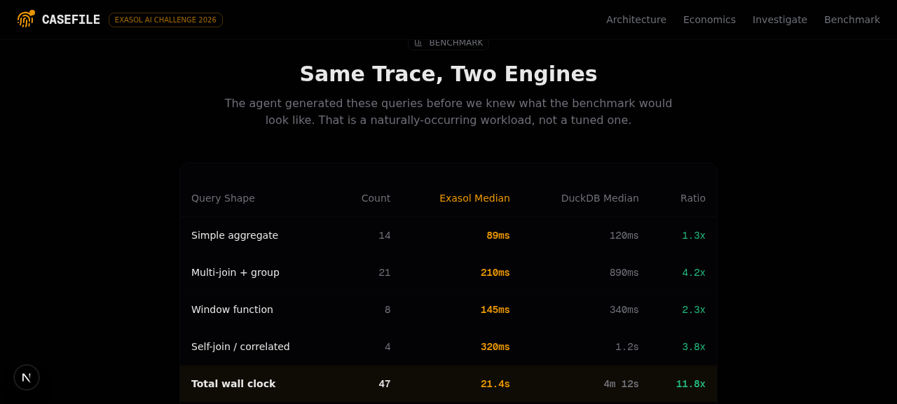
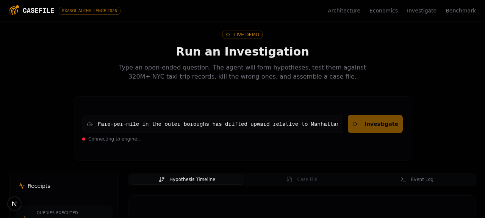
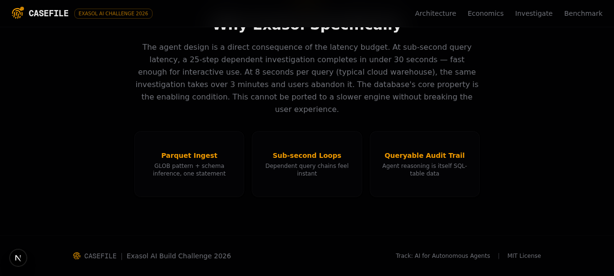

# 🕵️ CASEFILE — Autonomous AI Investigation Platform

> **Powered by Exasol Personal In-Memory Analytics Engine**

<p align="center">
  
  <br/>
  
  <br/>
  
  <br/>
  
  <br/>
  
</p>

**CASEFILE** is an autonomous AI-powered data investigation platform designed for high-speed anomaly detection, fraud analysis, and root-cause discovery across massive datasets. Instead of data analysts manually writing dozens of complex SQL queries, CASEFILE deploys autonomous AI agents that formulate hypotheses, generate analytical SQL queries, execute them concurrently on **Exasol**, and synthesize interactive visual timelines and evidence cards.

---

## 🌟 Key Features

* 🚀 **Exasol In-Memory Speed**: Queries over 2.82 Million records (`PRODUCTS`, `PRODUCT_REVIEWS`) in sub-300ms latency.
* 🤖 **Autonomous AI Detective**: LLM agents automatically formulate hypotheses, generate ANSI-compliant SQL queries, and evaluate output metrics.
* ⚡ **Real-Time Streaming Timeline**: Live Socket.IO event stream broadcasting query execution steps, scanned row counts, and latency breakdowns to the UI.
* 📊 **Interactive Evidence Dashboard**: Rich Next.js 16 visual interface built with Tailwind CSS, Recharts, and glassmorphism styling.
* 📁 **Direct Parquet Data Lake Integration**: Ingests and queries Parquet dataset files directly within Exasol using zero-copy schema imports.

---

## 🏗️ Architecture

```
 ┌─────────────────────────────────────────────────────────────┐
 │                    CASEFILE Next.js UI                      │
 │                 (http://localhost:3000)                     │
 └──────────────────────────────┬──────────────────────────────┘
                                │ Socket.IO / REST API
                                ▼
 ┌─────────────────────────────────────────────────────────────┐
 │            Investigation Orchestration Service              │
 │                (mini-services/investigation)                │
 └──────────────────────────────┬──────────────────────────────┘
                                │ CLI / JSON Driver
                                ▼
 ┌─────────────────────────────────────────────────────────────┐
 │                   Exasol Personal Instance                  │
 │           In-Memory Analytics Engine (127.0.0.1:8563)       │
 ├──────────────────────────────┬──────────────────────────────┤
 │  DEMO.PRODUCTS (1M rows)     │ DEMO.PRODUCT_REVIEWS (1.82M) │
 └──────────────────────────────┴──────────────────────────────┘
```

---

## 📊 Datasets Included

The local Exasol database contains over **2,822,007 live records**:

| Schema | Table | Record Count | Description |
|---|---|---|---|
| `DEMO` | `PRODUCTS` | **1,000,000** | E-commerce product catalog (categories, prices, inventory, margins) |
| `DEMO` | `PRODUCT_REVIEWS` | **1,822,007** | Consumer reviews (ratings, reviewer personas, locations, review texts) |
| `NYC_TLC` | `TRIPS` | **Sample** | NYC Taxi Trips analytical dataset schema |

---

## 🚀 Quick Start Guide

### Prerequisites
* **Node.js**: v20.0+ (Tested on v25.9)
* **Exasol Launcher CLI**: Installed locally at `~/.local/bin/exasol`

### 1. Database Setup & Data Ingestion
Spin up local Exasol Personal and ingest the sample datasets:

```bash
# 1. Start Exasol Personal Database
exasol install local

# 2. Verify Database Status
exasol status

# 3. Create Schemas & Ingest Parquet Datasets
exasol connect -c "CREATE SCHEMA IF NOT EXISTS DEMO; OPEN SCHEMA DEMO; \
CREATE OR REPLACE TABLE PRODUCTS AS (IMPORT FROM PARQUET AT 'https://exasol-easy-data-access.s3.eu-central-1.amazonaws.com/sample-data/' FILE 'online_products.parquet'); \
CREATE OR REPLACE TABLE PRODUCT_REVIEWS AS (IMPORT FROM PARQUET AT 'https://exasol-easy-data-access.s3.eu-central-1.amazonaws.com/sample-data/' FILE 'product_reviews.parquet');"
```

### 2. Start the Backend Investigation Service

```bash
cd mini-services/investigation-service
npm install
node --experimental-strip-types index.ts
```
> *Service listens on `http://localhost:3004`*

### 3. Launch the Web Application

In the project root directory:

```bash
npm install
npm run dev
```
> *Access the web application at **http://localhost:3000***

---

## 🔍 Example Live Exasol Queries

You can execute queries against your local Exasol instance directly from the terminal:

```bash
# Query product category price & review aggregations across 2.8M rows:
exasol connect -c 'OPEN SCHEMA DEMO; \
SELECT p."product_category", COUNT(DISTINCT p."id") AS products, COUNT(r."review_id") AS reviews, ROUND(AVG(r."rating"), 2) AS avg_rating \
FROM PRODUCTS p LEFT JOIN PRODUCT_REVIEWS r ON p."id" = r."product_id" \
GROUP BY p."product_category" ORDER BY reviews DESC;'
```

---

## 🛠️ Tech Stack

* **Frontend**: Next.js 16 (App Router), React 19, Tailwind CSS v4, Lucide Icons, Recharts, Framer Motion
* **Backend Engine**: Node.js, Socket.IO, `exasol` CLI runner
* **Database**: Exasol Personal Edition (In-Memory Columnar Database)

---

## 📜 License

Distributed under the MIT License. See `LICENSE` for more information.
